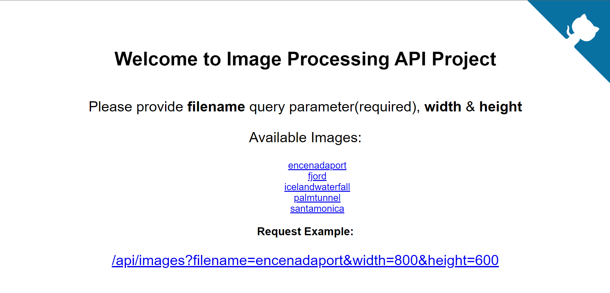

# Image Processing API

## Project Overview

[](https://youtu.be/DB7Zfb1NUSc)

This project aims to give you a real-world scenario in which you would read and write to your disk via a Node.js express server rather than a database. The project you create serves two purposes: to prepare you for setting up scalable code and architecture for real-world projects and tie together some of the most popular middleware and utilities found in Node.js projects. This project barely touches the surface of what is possible but will prove your ability to use what you’ve learned in real-world scenarios.

For this project, refactor and test as much as possible while you are building. Since you are using TypeScript and an unfamiliar library, it is sometimes easier to write and build in plain JS to see what your functions return; remember your submission needs to be in TypeScript. As your skills improve, typing in TypeScript will feel more intuitive. Make sure to remove any debugging code from your final submission.

<div align='center'>
    
</div>

## Project setup
```
npm install
```

### Start the server for development
```
npm run dev
```

### Compiles and minifies for production
```
npm run build
```

### Start the server after build `production`
```
npm run start
```

### Run the unit tests
```
npm run test
```

### Lints and run prettier to auto format
```
npm run format
```
```
npm run lint
```

### Lints and fixes files
```
npm run lint:fix
```


## API Reference

List available images which can be accessed through the endpoint

```GET /api/images```

Get specific image from the available images
```GET /api/images?filename={IMAGE_NAME}```


Create thumb version of image

```GET /api/images/?filename={IMAGE_NAME}&height={HEIGHT}&width={WIDTH}```

| Parameter | Type    | Required | Description                                 |
|-----------|---------|----------|---------------------------------------------|
| filename  | String  | true     | filename of the desired image to be resized |
| height    | Integer | false    | height of the desired image                 |
| width     | Integer | false    | width of the desired image                  |
